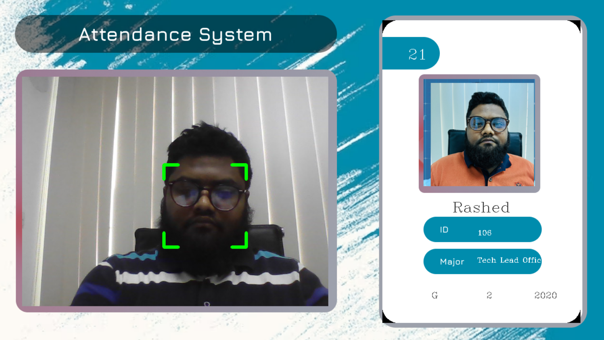
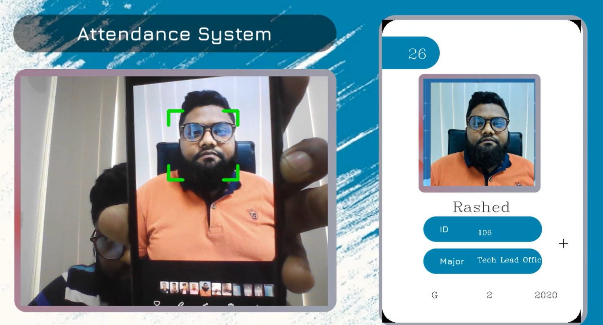

# Face Recognition Attendance System Using Python


## Overview

A Python-based attendance system using face recognition technology. This system leverages OpenCV, NumPy, and optional Face Recognition library to detect and identify faces in real-time, automatically marking attendance. Supports both MySQL (local) and Firebase (cloud) databases, making it perfect for educational institutions and organizations.

**Key Problem Solved:** Eliminates manual attendance tracking, reduces proxy attendance, and provides accurate, automated attendance management.

## Features

- ✅ **Real-time face detection and recognition**
- ✅ **Automated attendance marking and tracking**
- ✅ **MySQL local database integration**
- ✅ **Firebase cloud storage (optional)**
- ✅ **User-friendly graphical interface**
- ✅ **Multiple face encoding support**
- ✅ **Attendance history and reporting**
- ✅ **Cross-platform compatibility**

### Why use this project?
- **Accuracy**: Advanced face recognition algorithms ensure reliable identification
- **Flexibility**: Choose between local MySQL or cloud Firebase storage
- **Scalability**: Supports multiple users and institutions
- **Efficiency**: Reduces manual work and human errors
- **Security**: Secure cloud storage and encrypted data handling

## Demo / Screenshots

### Video Demo
[](https://www.youtube.com/watch?v=7UGcHzpqqTw)

### Screenshots
| Screenshot | Description |
|------------|-------------|
|  | Face detected |
|  | Main interface with camera feed |
|  | Main interface with student information |
|  | Face recognition in progress |


## Installation

### Prerequisites
- Python 3.7 or higher
- Webcam or camera device
- MySQL Server (for local database) OR Firebase account (for cloud storage)
- CMake (optional, for face recognition features)

### Quick Setup

1. **Clone the repository:**
   ```bash
   git clone https://github.com/jmrashed/Face-Recognition-Attendance-System-Using-Python.git
   cd Face-Recognition-Attendance-System-Using-Python
   ```

2. **Create virtual environment (recommended):**
   ```bash
   python -m venv venv
   # Windows
   venv\Scripts\activate
   # macOS/Linux
   source venv/bin/activate
   ```

3. **Install core dependencies:**
   ```bash
   pip install opencv-python mysql-connector-python cvzone numpy
   ```

4. **Choose your database setup:**

   **Option A: MySQL (Recommended - Local)**
   - Install MySQL Server locally
   - Database: `face-recognition`
   - User: `root`, Password: (empty)
   
   **Option B: Firebase (Cloud)**
   - Create Firebase project at [Firebase Console](https://console.firebase.google.com/)
   - Download `serviceAccountKey.json` to `src/config/`
   - Install: `pip install firebase-admin`

### Dependencies
- [OpenCV](https://pypi.org/project/opencv-python/) - Computer vision library
- [NumPy](https://pypi.org/project/numpy/) - Numerical computing
- [CVZone](https://pypi.org/project/cvzone/) - Computer vision utilities
- [MySQL Connector](https://pypi.org/project/mysql-connector-python/) - MySQL database integration
- [face-recognition](https://pypi.org/project/face-recognition/) - Face recognition library (optional, requires CMake)
- [firebase-admin](https://pypi.org/project/firebase-admin/) - Firebase integration (optional)

## Usage

### Quick Start

```bash
# Interactive menu
python run.py
```

### Manual Commands

1. **Setup MySQL database:**
   ```bash
   python src/database/add_data_mysql.py
   ```

2. **Test database connection:**
   ```bash
   python tests/test_mysql_connection.py
   ```

3. **Add student images:**
   ```bash
   # Place student images in assets/images/ folder
   # Format: <student_id>.png (e.g., 104.png, 105.png)
   ```

4. **Generate face encodings (requires face-recognition):**
   ```bash
   python src/database/encode_generator.py
   ```

5. **Run attendance system:**
   ```bash
   # MySQL version (recommended)
   python src/main_mysql.py
   
   # Firebase version (original)
   python src/main.py
   ```

### Project Structure

```
face-recognition-attendance-system/
├── src/                    # Main application code
│   ├── config/            # Configuration files
│   ├── database/          # Database operations
│   ├── main_mysql.py      # MySQL version (recommended)
│   └── main.py            # Firebase version
├── tests/                 # Test files
├── assets/                # Images and resources
│   ├── images/           # Student photos
│   ├── screenshots/      # Documentation images
│   └── resources/        # UI resources
├── docs/                  # Documentation
└── run.py                # Main entry point
```

### Configuration

**MySQL Configuration** (in `src/config/mysql_config.py`):
```python
MYSQL_CONFIG = {
    'host': 'localhost',
    'database': 'face-recognition',
    'user': 'root',
    'password': ''
}
```

## API Reference

### Core Functions

```python
# Face encoding generation
generate_encodings(image_path: str) -> list

# Attendance marking
mark_attendance(student_id: str, timestamp: datetime) -> bool

# Database operations
upload_student_data(student_info: dict) -> bool
get_student_info(student_id: str) -> dict
```

## Contributing

We welcome contributions! Here's how you can help:

### Getting Started
1. Fork the repository
2. Create a feature branch (`git checkout -b feature/amazing-feature`)
3. Commit your changes (`git commit -m 'Add amazing feature'`)
4. Push to the branch (`git push origin feature/amazing-feature`)
5. Open a Pull Request

### Coding Standards
- Follow PEP 8 style guidelines
- Add docstrings to all functions
- Include unit tests for new features
- Update documentation as needed

### Good First Issues
Look for issues labeled `good first issue` or `help wanted` in the Issues tab.

## Roadmap

- [ ] **v2.0**: Web-based dashboard
- [ ] **v2.1**: Mobile app integration
- [ ] **v2.2**: Multi-camera support
- [ ] **v2.3**: Advanced analytics and reporting
- [ ] **v2.4**: Integration with popular LMS platforms
- [ ] **v3.0**: AI-powered attendance insights

## FAQ / Troubleshooting

### Common Issues

**Q: ModuleNotFoundError: No module named 'cv2'**
A: Install OpenCV: `pip install opencv-python`

**Q: ModuleNotFoundError: No module named 'mysql'**
A: Install MySQL connector: `pip install mysql-connector-python`

**Q: face-recognition installation fails**
A: Install CMake from [cmake.org](https://cmake.org/download/) and add to PATH, then retry.

**Q: Camera not detected**
A: Check camera permissions and ensure no other applications are using the camera.

**Q: MySQL connection errors**
A: Verify MySQL server is running and credentials are correct.

**Q: Face recognition accuracy is low**
A: Ensure good lighting conditions and high-quality reference images.

### Performance Tips
- Use images with resolution 640x480 for optimal performance
- Ensure consistent lighting in the environment
- Clean camera lens regularly
- Use MySQL for faster local database operations

## License

This project is licensed under the MIT License - see the [LICENSE](LICENSE.md) file for details.

## Acknowledgements

- [Adam Geitgey](https://github.com/ageitgey) for the face_recognition library
- [OpenCV](https://opencv.org/) community for computer vision tools
- [Firebase](https://firebase.google.com/) for backend services
- [CVZone](https://github.com/cvzone/cvzone) for additional CV utilities

## Database Options

### MySQL (Recommended)
- ✅ Local database - no internet required
- ✅ Faster queries and operations
- ✅ Easy setup and configuration
- ✅ Student images stored locally

### Firebase (Original)
- ☁️ Cloud database - internet required
- 🔒 Secure cloud storage
- 📱 Multi-device access
- 💾 Automatic backups

## Support / Contact

- **GitHub Issues**: [Create an issue](https://github.com/jmrashed/Face-Recognition-Attendance-System-Using-Python/issues)
- **Documentation**: See `docs/` folder for detailed guides
- **MySQL Setup**: See `docs/MySQL_Setup_Guide.md`

---

⭐ **Star this repository if you found it helpful!**

**Made with ❤️ by [JM Rashed](https://github.com/jmrashed)**
