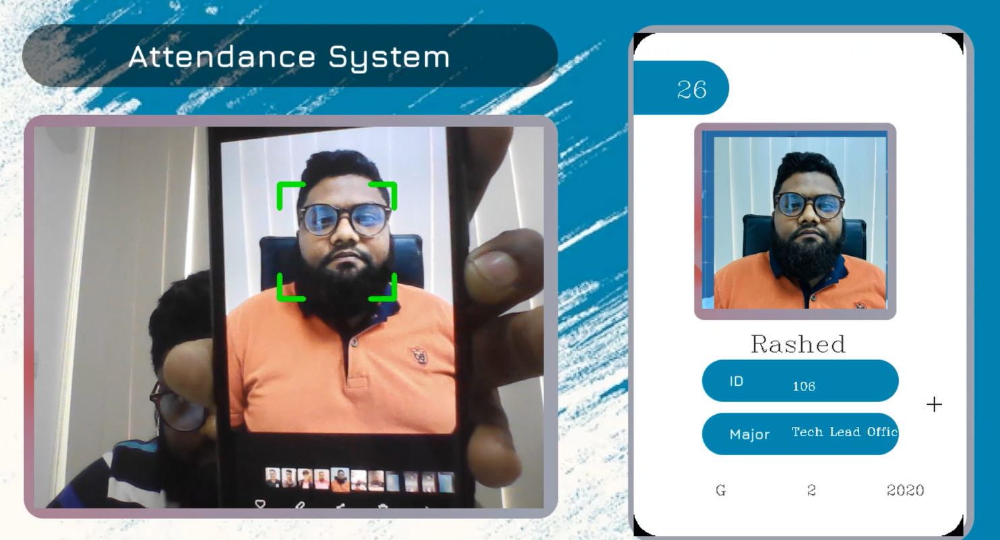
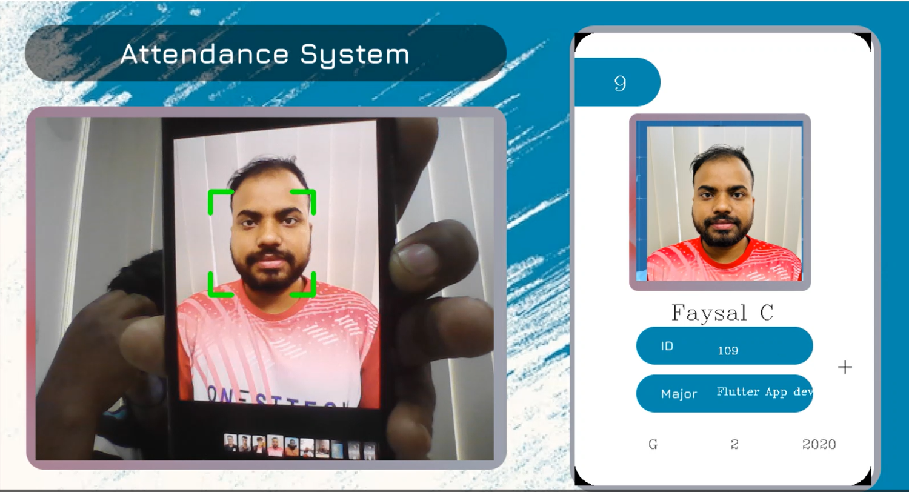
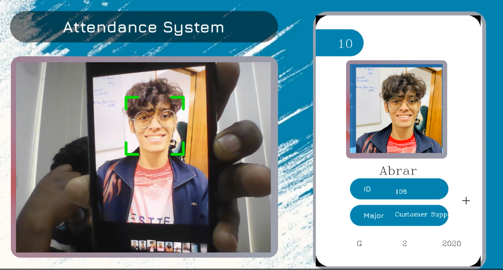

# Face Recognition Attendance System Using Python
This is a Python project that demonstrates the implementation of a face recognition attendance system. The system uses OpenCV, Numpy, and Face Recognition libraries to detect faces in real-time, recognize individuals based on their facial features, and mark their attendance.

# Requirements
- Python 3.x
- OpenCV
- Numpy
- Face Recognition


# Installation
- Clone or download this repository to your local machine.
- Install the required libraries using pip:

```pip install opencv-python numpy face-recognition```
# Usage
- Collect a dataset of images of individuals who will be attending the class or office.
- Pre-process the images by converting them to grayscale, detecting faces, and cropping them to a standard size.
- Train the model using the pre-processed images.
- Use the trained model to recognize faces in real-time and mark attendance.
# Demo 
    [](https://www.youtube.com/watch?v=7UGcHzpqqTw)
###  Screenshot 01


### Screenshot 02


### Screenshot 03



### Screenshot 04



# Contribution
Contributions are welcome! If you find any issues or want to add new features, feel free to create a pull request.

# License
This project is licensed under the MIT License. See the [LICENSE](LICENSE.md) file for details.
